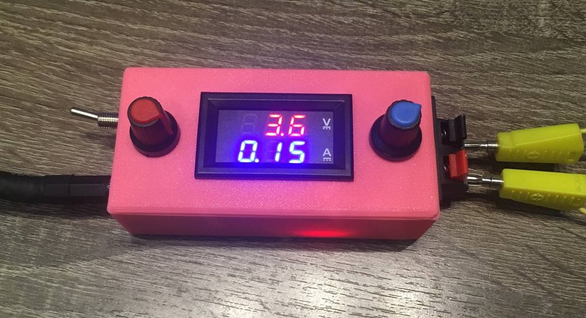
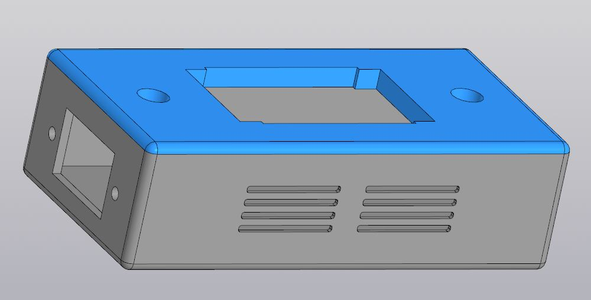
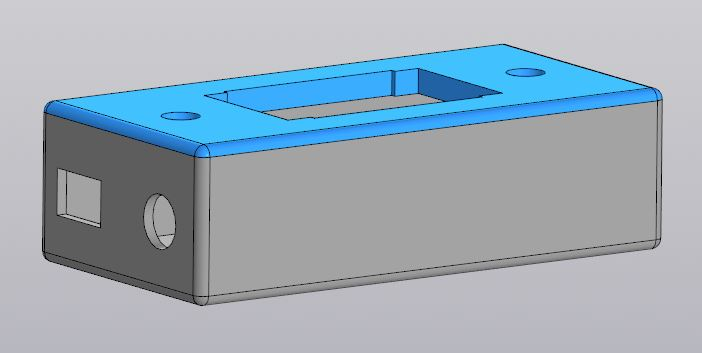

#  Adjustable Laboratory Power Supply (3V – 19.8V / 0 – 3.15A)

A compact, fully assembled bench-mounted power supply designed for prototyping and testing electronic circuits. It is equipped with precision voltage and current control, digital feedback. It is housed in a special case printed on a 3D printer.

*Final assembly with OLED display and potentiometers*

---

##  Features

- **Voltage Range**: 3.0 V – 19.8 V (adjustable in 0.1V steps)
- **Current Limit**: Up to 3.15 A
- **Digital Monitoring**: Real-time voltage and current readout via OLED display (128x64, I2C)
- **Control Interface**: Two potentiometers  for precise adjustment
- **Enclosure**: Custom-designed 3D-printed case (PLA), ergonomic layout, and aesthetic finish
- **Regulation**: Based on LM2596-based DC-DC buck converter module with stable output

---

##  Hardware Components

| Component | Purpose |
|---------|--------|
| LM2596 Buck Converter Module | Voltage regulation |
| Electronic voltmeter-ammeter | Current and voltage monitoring |
| 2x Potentiometers | User input for voltage/current adjustment |
| Tactile Buttons | Turning on the device |
| Power Socket | Power socket for connecting a 12-24V power supply|
| Terminals of two connectors | Terminals of two connectors for connecting crocodile clips |
| 3D-Printed Case | Mechanical housing and protection |

---

##  Design Files

- **Schematic**: [`schematic.pdf`](./schematic.pdf) — Full circuit diagram
- **3D Model**: Available for download on [Cults3D](https://www.cults3d.com/en/3d-model/various/power-supply-case) — Designed in Kompas 3D

---

##  Assembly Photos

|  |  |  |
|:---:|:---:|:---:|

---

##  How It Works

1. The user adjusts the target voltage using the left rotary encoder.
2. The Arduino sends a PWM or analog signal to the LM2596 module to set the output.
3. The INA219 continuously measures actual voltage and current.
4. Values are displayed on the OLED screen in real time.
5. Over-current protection can be implemented in software (optional).

The system operates in a closed loop, ensuring stable and safe power delivery.

---

##  Usage Tips

- Always double-check polarity before connecting a load.
- Calibrate the INA219 sensor for accurate readings.
- Use thick enough wires for high-current applications (>2A).
- Ensure proper ventilation — the buck converter generates heat under load.

---

##  License

This project is open-source and licensed under the **MIT License**.  
See the [LICENSE](../../LICENSE) file in the root repository for details.

You are free to use, modify, and distribute the design, provided you include attribution.

---

