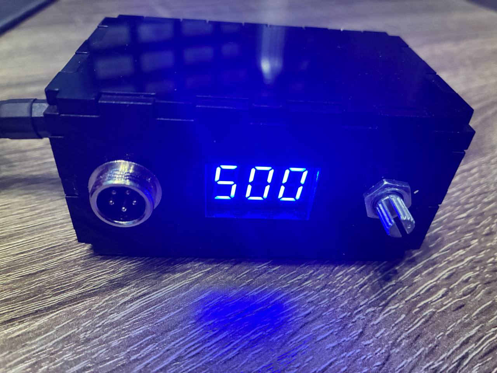
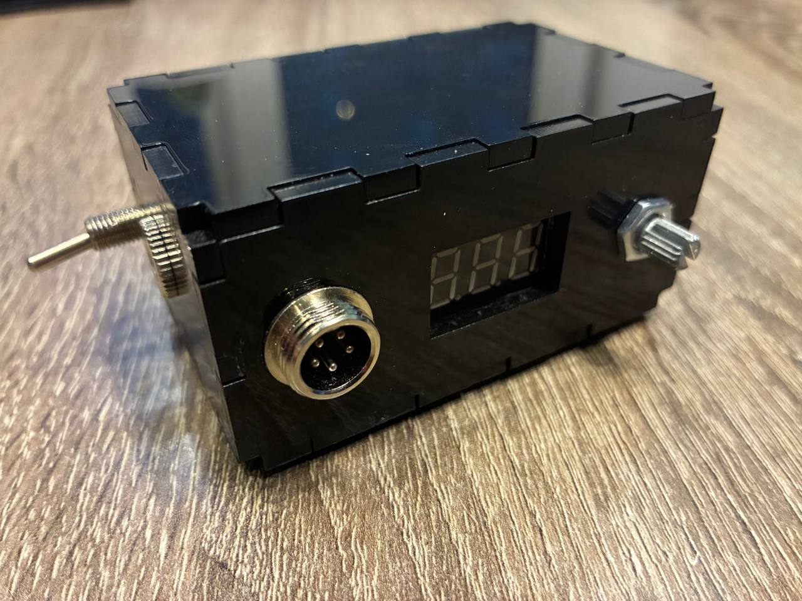

#  Mini Soldering Station on the base Hanlei T12

A compact, custom-built soldering station based on the popular **Hanlei T12** controller board. Enhanced with a sleek acrylic enclosure, dedicated power input, and a physical power switch for improved usability and safety.

*Front panel with digital display, potentiometer, and power connector*

---

##  Features

- **Core Controller**: Hanlei T12 
- **Enclosure**: Custom laser-cut black acrylic case with precise cutouts and ventilation grid
- **Power Input**: Dedicated 5-pin XLR-style connector for stable DC power delivery
- **Power Switch**: Physical toggle switch for safe on/off control
- **Display**: Integrated 3-segment LED display for temperature readout
- **Control**: Potentiometer for intuitive menu navigation
- **Ventilation**: Perforated back panel for heat dissipation during prolonged use

---

##  Hardware Modifications

- Added a **dedicated power socket** to avoid using micro-USB for high-current applications.
- Installed a **latching power switch** for quick and safe shutdown.
- Designed a **ventilated rear panel** to prevent overheating of the controller board.
- All components are securely mounted using standoffs and screws for durability.

> With this design, the priority is given to compactness and reliability. 

---

##  Design Files

- **2D Model DXF / Laser Cut**: Available for download on [Cults3D](https://cults3d.com/:3684383) — designed in QCAD

---

##  Assembly Photos

|  |  |  |
|:---:|:---:|:---:|
| Power connector and display | Ventilated rear with rubber feet | Clean internal layout with secure mounting |

---

##  How It Works

1. The Hanlei T12 board controls the heating element via PID algorithm.
2. Temperature is displayed on the 3-segment LED.
3. User adjusts settings via the potentiometer.
4. Power is supplied through the XLR connector and controlled by the front-panel switch.
5. Heat dissipates through the perforated back panel.

The station supports multiple tip types (T12, JBC, etc.) and can be calibrated for precise temperature control.

---

##  Usage Tips

- Always use a regulated DC power supply (recommended: 24V, 3A+).
- Avoid touching the heating element or tip during operation.
- Clean the tip regularly with a damp sponge or brass wool.

---

##  License

This project is licensed under the **MIT License**.  
See the [LICENSE](../../LICENSE) file in the root repository for details.

You are free to use, modify, and distribute the design, provided you include attribution.
